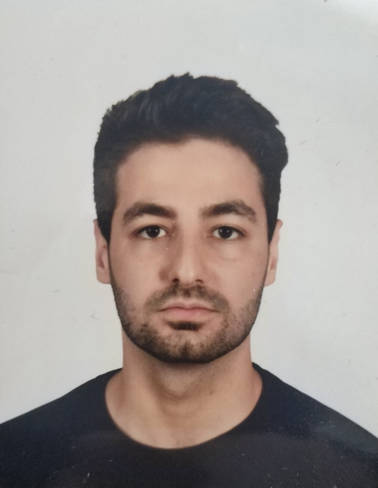

# Curriculum Vitae | Cagri Avci

---

## Practical information

name: **Cagri Cem Avci** 
 
current position: **Student** 
current home location: **Ghent, Belgium** 
Email: **<cagravci@student.arteveldehs.be>** 
Social: [Github](https://github.com/pgm-cagravci) 

---

## About
> Hello, I am Cagri. I am 28 years old and study programming at Artevelede University College. I enjoy hiking and listening to music. 

## Skill
- NodeJS
- ExpressJS
- Javascript
- SQL
- HTML & CSS
- SASS
- Static pages (Eleventy, Nunjucks)

## Experience
*2020 - 2021* Student Programming, at Artevelde University College
*2018 - 2020* Data Analyst, at Colruyt Group Academy
*2014 - 2018* Bachelors Business Management - Marketing, at Artevelde University College

## Education
- Bachelors Business Management

## Languages
- Dutch ++++
- English ++++
- Turkish ++++
- French ++

## References
- [Philippe De Pauw - Waterschoot](https://be.linkedin.com/in/philippe-de-pauw)

## Interests
My interest are working on projects and solving business problems.